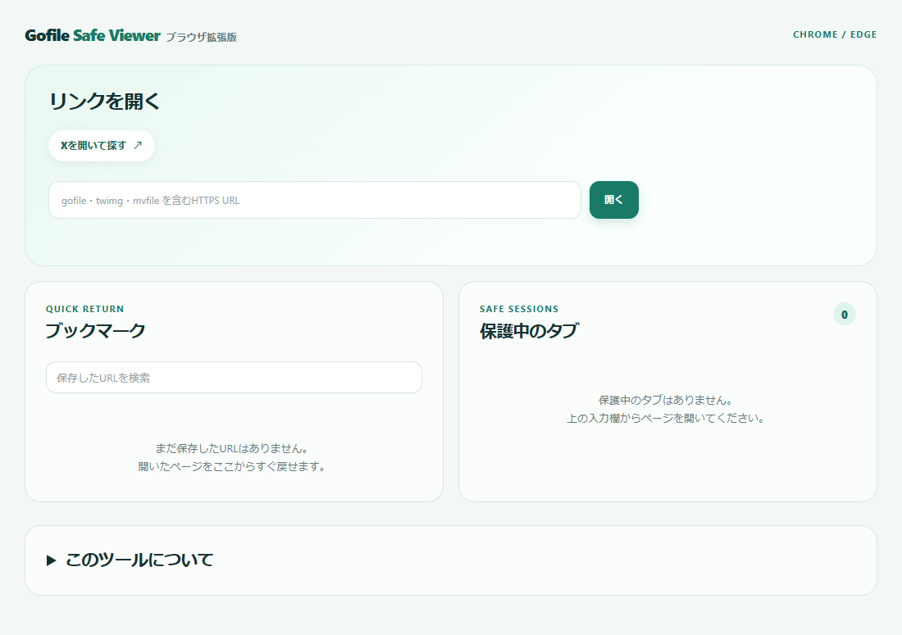

# Gofile Safe Viewer ブラウザ拡張版

**動画共有リンクを開くときの、意図しないページ移動やポップアップを減らすツールです。**

URLに `gofile`・`twimg`・`mvfile` を含むHTTPSリンクが対象です。Xは、X上で検索してリンクを探すための入口として利用できます。Chrome / Microsoft Edgeのタブに閲覧制限をかける拡張機能で、ページや動画は元のサイトから直接読み込みます。

**[最新版をダウンロード](https://github.com/urea/gofile-safe-viewer-extension/releases/latest)** · [Android版](https://github.com/urea/gofile-safe-viewer)



## できること

- この拡張機能から開いたタブで、許可条件に合わないページ移動や通信をブロック。
- ページが開くポップアップ、一部の自動ダウンロードや浮動広告を抑制。
- Xを開いてリンクを探す、または手元のURLを貼り付けて開く。
- 見たいページをブックマークに保存し、ホームから検索・再表示。

`SAFE` は閲覧制限が有効な目印です。サイトやファイル自体の安全性を保証するものではありません。

## インストール

Chrome / Microsoft Edge **129以降**が必要です。現在はストア未公開のため、GitHubのZIPを手動で読み込みます。ビルドやNode.jsのインストールは不要です。

1. [最新Release](https://github.com/urea/gofile-safe-viewer-extension/releases/latest)の **Assets** から `GofileSafeViewerPC-v0.1.8.zip` をダウンロードします。
2. ZIPを展開し、今後も使用する場所にフォルダを置きます。読み込み後もこのフォルダは残してください。
3. Chromeは `chrome://extensions`、Edgeは `edge://extensions` をアドレス欄に入力して開きます。
4. **デベロッパーモード**を有効にし、**パッケージ化されていない拡張機能を読み込む**を選びます。
5. 展開したフォルダのうち、`manifest.json` があるフォルダを選びます。
6. ツールバーの拡張機能一覧からピン留めすると、ホームを開きやすくなります。

ソースをcloneした場合は、リポジトリ内の `extension` フォルダを指定してください。GitHubが自動生成する「Source code」のZIPを使用する場合も同様です。

## 使い方

1. 拡張機能のアイコンから **ホームを開く** を選びます。
2. **Xを開いて探す** を押すか、対応するURLを入力して **開く** を押します。
3. 開いたタブで閲覧します。閲覧中のアイコン、またはホームの **保護中のタブ → 保存** からブックマークに追加できます。

制限はこの拡張機能から開いたタブに適用されます。通常のタブには適用されません。操作画面の下部にある **このツールについて** を開くと、使い方やしくみを確認できます。

**ブラウザの再起動や拡張機能の再読み込み・更新後は、ホームから閲覧タブを開き直してください。** ブラウザが復元した前回のタブは、そのままでは制限対象になりません。通常のバックグラウンド処理の休止・復帰では制限を維持します。

### 更新方法

新しいZIPを展開して、最初に読み込んだフォルダのファイルを置き換え、拡張機能管理画面の再読み込みボタンを押してください。同じフォルダを使えばブックマークは保持されます。拡張機能を削除して再インストールすると、保存データは失われます。

## しくみ・プライバシー

このホームはブラウザ拡張機能の操作画面です。開いたタブに通信ルールを設定し、ブラウザが許可先・遮断先を判定します。動画の表示や再生は元のサイトとブラウザが行い、開発者の中継サーバーは使いません。

- **ログイン状態は普段のブラウザと共通です。** 独立したログイン領域やシークレットモードではありません。
- ブックマークは `chrome.storage.local` に保存し、同期や開発者への送信は行いません。
- 独自の閲覧履歴・ログイン情報・アクセス解析は収集しません。閲覧先のサイトとの通信は発生します。

### 拡張機能が使う権限

| 権限 | 用途 |
| --- | --- |
| `tabs` | 対象タブのURL・タイトル表示、タブの開閉 |
| `storage` | ブックマークと一時的なタブ情報の保存 |
| `declarativeNetRequest` | 対象タブの通信を許可・遮断 |
| `webNavigation` | ページ遷移とポップアップの検出 |
| `scripting` | 対象タブでのポップアップ抑制 |
| HTTP/HTTPSサイトへのアクセス | URL全体の文字列判定とページ内の動作抑制 |

広いサイトアクセス権限は、ドメイン名だけでなくURL内の文字列を判定するために必要です。通常タブでもコンテンツスクリプトは対象かどうかを問い合わせますが、ページへの抑制処理は制限対象のタブだけで行います。

## URLの許可条件

| 対象 | ページ移動 | ページ内の読み込み |
| --- | --- | --- |
| URLに `gofile`・`twimg`・`mvfile` を含む | 許可 | 許可 |
| `x.com` とそのサブドメイン | 許可 | 許可 |
| `t.co` 完全一致 | 許可。転送先も判定 | 許可 |
| `fun800.click` とそのサブドメイン | 上記条件を満たさなければ遮断 | 許可 |
| その他 | 遮断 | 対象タブに関連付いた通信を遮断 |

すべてHTTPSのみです。文字列判定は大文字・小文字を区別せず、ホスト名・パス・クエリが対象です。`#` 以降は許可の根拠になりません。ユーザー名・パスワードを含むURLは拒否します。

**厳密なドメイン許可リストではありません。** たとえば `https://example.com/?q=mvfile` も許可されます。一方、`goflile.io` は `gofile` とは綴りが異なるため、それだけでは許可されません。

## 制限と、表示できないときの確認

すべての広告やダウンロードを防ぐ機能ではありません。通常のリンクが要求する別タブを同じタブで開く、`window.open` を抑える、`download` 属性や添付ファイル応答を遮断する、といった範囲で動作します。添付ファイル応答を遮断する場合、リクエスト自体は相手に届きます。ポップアップも、最初の通信を必ず止められるわけではありません。

Service Workerのキャッシュ・バックグラウンド通信、`blob:` / `data:`、外部アプリの起動、ブラウザメニューからの保存など、タブに紐付かない通信やブラウザ固有の動作は完全には制御しません。

- **「ブロックされています」「ERR_BLOCKED_BY_CLIENT」と表示される：** URLや転送先が許可条件に合うかを確認してください。別の広告ブロッカーが原因になる場合もあります。
- **「コンテンツはありません」と表示される：** 閲覧先サイトの応答の場合もあります。言語設定やサイト側の条件なども影響するため、拡張機能の遮断とは限りません。
- **再起動後にSAFEが付かない：** ホームからリンクを開き直してください。

## 開発・検証

拡張機能本体は `extension/` 内のHTML・CSS・JavaScriptで構成され、ビルド不要です。

```powershell
# Node.jsで単体テスト
npm test

# PowerShellで拡張機能だけをZIP化（SHA-256も出力）
powershell -ExecutionPolicy Bypass -File scripts/package.ps1
```

ブラウザ検証は `scripts/browser-smoke.cjs` で行います。Node.js、Playwright、Playwright版Chromium、OpenSSLが必要です。

```powershell
npm install --no-save --package-lock=false playwright
npx playwright install chromium
node scripts/browser-smoke.cjs
```

既存の環境は `PLAYWRIGHT_MODULE`、`PLAYWRIGHT_BROWSERS_PATH`、`OPENSSL_PATH` で指定できます。WindowsでのOpenSSLの既定値はGit for Windowsのインストール先です。検証は一時HTTPSサーバーと専用ブラウザプロファイルで行い、自己署名証明書を許可する設定はテスト用ブラウザだけに適用します。

2026-09-15時点で単体テスト5件、Chromiumで14項目の検証が通過しています。許可・遮断、通常タブとの分離、ブックマーク、ポップアップ・添付応答の抑制、並行タブ作成、バックグラウンド休止・復帰、ブラウザ再起動を確認しています。Edgeでの実機確認や、すべての対応サイト・動画の再生を網羅した検証は行っていません。

`_private/`（作業メモ）、`output/`（検証結果・プロファイル）、`dist/`（配布物）、`node_modules/` はGit管理対象外です。配布ZIPには `extension/` の中身だけを含めます。
